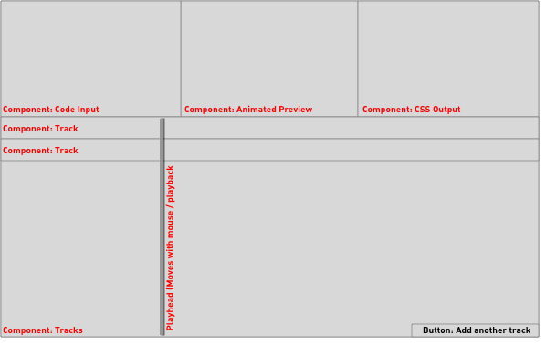
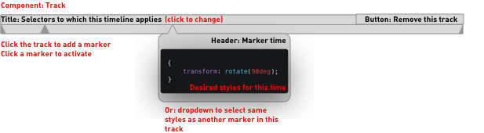

# Concept

Keef is a tool for generating multiple CSS @keyframes animations to animate multiple HTML elements at the same time.

## UI

The UI is split vertically, with the top row containing code and a preview and the bottom row showing the user's tracks.



The top row has three components[1], MarkupInput, Preview and CSSOutput.

The user can paste or type HTML (including SVG) into the MarkupInput (we may need to do some sanitisation on this to prevent XSS, although given this will only ever run on the user's machine I'm not sure how necessary that is).

The Preview will be a sandboxed iframe showing the result of the users markup and the generated CSS (similar to how the preview works on CodePen).

The CSSOutput will show the generated CSS, allowing the user to copy it out. (Initially read-only, but potentially we could allow changes here to update the state and therefore the timelines).

Users set a duration for the animation (in ms) as well as other animation properties (easing, delay, iteration count, duration), then add Tracks, one per element to be animated.

Tracks appear in the UI similar to those in video editing software, full width, stacked vertically. Tracks that overflow the window will be scrollable.

When adding a Track, the user must specify the CSS selectors to which this animation will apply[2].

When a Track is added, it will show in the UI and exist in the React state held by the App.

The user can click anywhere along the length of the Track to add a Marker. A newly added Marker is active, or the user can click a marker to activate it. Active markers show their position along the track as a percentage and a code input where they can enter the styles that should be applied to the selector elements at this point in the animation. [3] The user can also choose to duplicate styles from another marker on the timeline[4].

Users can also delete a track or a marker at any time.



The App will generate valid CSS to apply these animations to the specified selectors, see [Output](#output)

## Output

### Styles for the selectors

```
${selectors}: {
    animation-name: ${generatedAnimationName};
    animation-duration: ${duration};
    animation-iteration-count: ${iterations};
    ...etc
}
```

This can be written shorthand

### Keyframes definitions

```
@keyframes ${generatedAnimationName} {
    ${markers.map(marker => `
      ${marker.percentage} {
          ${marker.styles}
      }
    `)}
}
```

## Preview

From looking at the source of Codepen, it looks like they use a [sandboxed](https://developer.mozilla.org/en-US/docs/Web/HTML/Element/iframe#attr-sandbox) iframe to safely run user-entered code. It looks pretty easy to replicate this technique, we'd basically want to render:

```
<iframe srcdoc="${sanitised html and generated CSS}" sandbox />
```

By defining the sandbox attribute and leaving it empty, I think that limits the functionality available inside the iframe as much as possible. Given we're just asking people to paste in HTML this seems like a good idea.

[1] I would also like to add an optional reference video here. This would be a user-hosted video and could be used to set the animation duration to match the video duration (which may also be trimmed in-app), Video playback would also synchronise playback in the Preview. This would allow a user to build a CSS animation that closely matches a video, rather than having to figure out timings themselves.

[2] It would be nice if we could validate that the entered selectors exist in the user's markup and maybe highlight them in the preview when hovering this track.

[3] I think we could add some really nice functionality here to make it easier to use - like showing the styles applied by previous Markers so the user can see how far the motion is progressing.

[4] This is a useful technique to pause an animation - eg. animating something from red to blue to blue to purple would make it appear as though it paused on blue before turning purple ([see demo](https://codepen.io/gingerchris/pen/ExNqogJ)).
